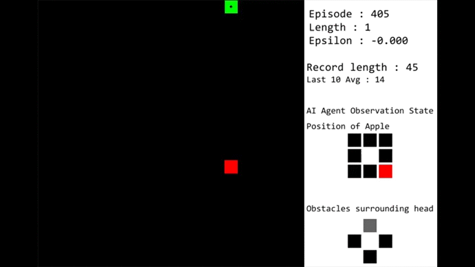

# Snake-AI
Classic snake game with AI. 

## First AI is a Q-Learning model (A Reinforcement Learning technique)

It looks one step ahead. Hence, finds most of the time trapping itself.

## Second one is using A-star Pathfinding algorithm (Kind of a brute force type)

This one finds the shortest path towards the apple. It suffers when there is no path as the snake's body covers it, and does random moves and dies most of the time.
